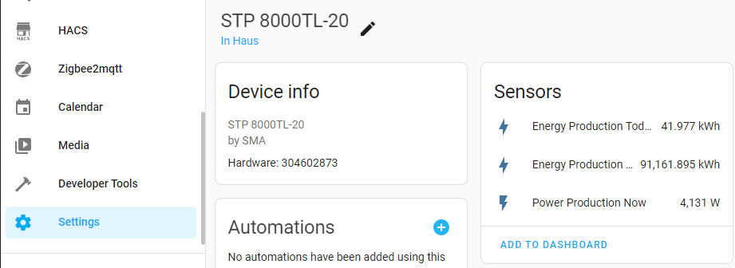
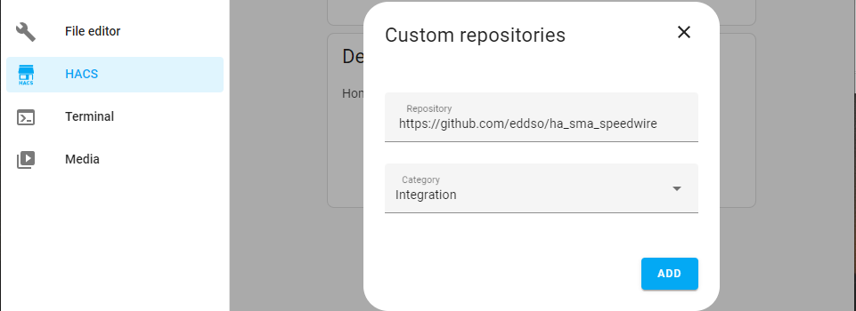
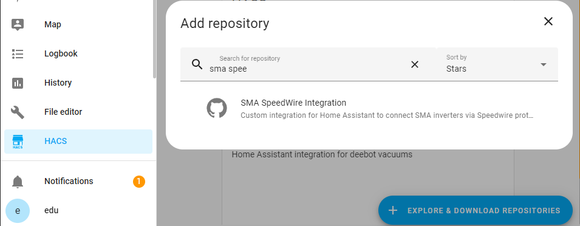
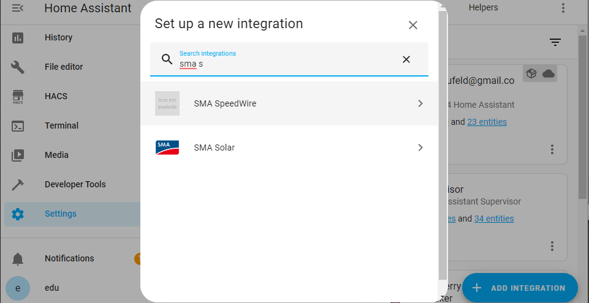
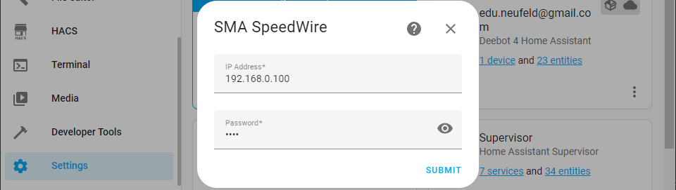

# SMA SpeedWire Integration for Home Assistant  

# I don't work on this integration sins my inverter died, can't test changes, sorry.

Custom integration for Home Assistant to connect SMA inverters via SpeedWire protocol. The integration polls every 5 minutes only 3 entities because i only needed it for my Energy Dashboard:
- Energy production total in kWh
- Energy production today in kWh
- Power production now in kW


The integration should support a range of SMA Inverters here a [list](https://github.com/eddso/ha_sma_speedwire/blob/39602431658489f4351875d33fa17b9595e79a82/custom_components/sma_speedwire/sma_speedwire.py#L27).  

## Installation
### a) Install over HACS
- Add `https://github.com/eddso/ha_sma_speedwire` repository to HACS integrations


- Add `SMA SpeedWire Integration` integration with HACS

### b) Install manual
If you don't have or don't want use HACS, install it over Terminal:
```
cd config/custom_components
wget https://github.com/eddso/ha_sma_speedwire/archive/refs/heads/main.tar.gz
tar --strip-components=3 -xzf main.tar.gz ha_sma_speedwire-main/custom_components/sma_speedwire
```
### Restart 
After install restart Home-Assistant under the  Configuration -> System -> Restart

## Setup
- After installation, you should find **SMA SpeedWire** under the Configuration -> Integrations -> Add integration.


- Enter IP and password (default password is '0000') of inverter on integration setup. Normaly the inverter get the IP over DHCP. So you should configure your router to give always the same IP to inverter.


## Debugging
Add the following to `configuration.yml` to show debugging logs. Please make sure to include debug logs when filing an issue.

See [logger intergration docs](https://www.home-assistant.io/integrations/logger/) for more information to configure logging.

```yml
logger:
  default: warning
  logs:
    custom_components.sma_sppedwire: debug
```

## Credits
Inspired from [SMAInverter](https://github.com/Rincewind76/SMAInverter).
